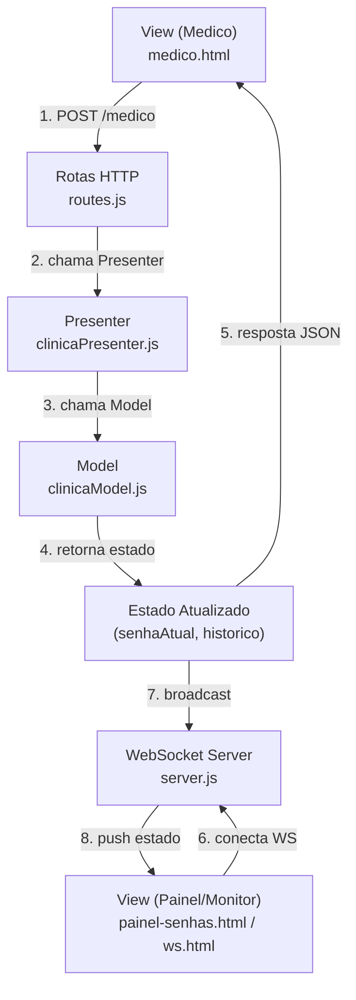

# Implementação de Comunicação Bidirecional para Gestão de Filas em Ambientes hospitalares

Aplicação web para simulação de painel de senhas em clínica, com atualização em tempo real usando WebSocket.

## Techs


## Requisitos

- Node.js 18+ 
- npm

## Instalação

```bash
npm install
```

## Execução

Modo desenvolvimento (com recarga automática):

```bash
npm run dev
```

Modo normal:

```bash
npm start
```

Servidor padrão:

- `http://localhost:3000`

## Rotas principais

- `/` -> tela inicial
- `/medico` -> painel para chamar próxima senha
- `/painel-senhas` -> painel de exibição de senha
- `/ws` -> monitor de conexão WebSocket
- `/estado` -> estado atual (JSON)
- `/historico` -> últimas senhas chamadas (JSON)

## Como testar rapidamente

1. Abra `http://localhost:3000/medico` em uma aba.
2. Abra `http://localhost:3000/painel-senhas` em outra aba.
3. Clique em **Chamar Próximo Paciente** no painel do médico.
4. Verifique a atualização instantânea no painel de senhas.

## Scripts npm

- `npm run dev` -> inicia com nodemon
- `npm start` -> inicia com node
- `npm test` -> placeholder padrão do projeto

## Diagrama de Fluxo (Arquitetura MVP)



### - Model (clinicaModel): 
guarda e manipula os dados da fila (senha atual e historico) em memoria. Ele não sabe nada de HTML, rotas ou WebSocket
### - View (app/views/*.html): 
representa as telas (médico, painel de senhas, monitor WS). Ela apenas exibe informaçoẽs e dispara açoẽs do usuário.
### - Presenter (clinicaPresenter): 
faz a ponte entre View e Model. Recebe eventos (HTTP/WS), chama regras do Model e devolve o estado atualizado para as views/clientes.

## Relatório Técnico

[](./docs/Relatório.pdf)
